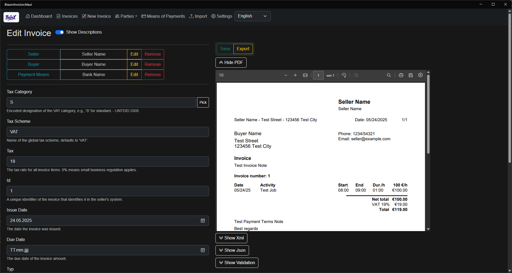

# BeInX
**Blazor eInvoice XRechnung App**

BeInX is a lightweight, open-source application designed to create, manage, and export simplified e-invoices for freelancers in compliance with the XRechnung and ZUGFeRD standard. It runs locally and completely offline.

## Supported Languages
* English
* German
* Spanish
* French

## Installation
To install the latest release:
1. Download the app from the  [latest GitHub release](https://github.com/ipax77/beinx/releases/latest) 
2. Follow the official [.NET MAUI Windows app installation guide](https://learn.microsoft.com/en-us/dotnet/maui/windows/deployment/publish-cli#installing-the-app).

## Limitations
* Only **one VAT category** per invoice
* Only **credit transfer** is supported as a payment method
* PDF generation optimized for **time-based services**
* Currently runs on Windows Desktop only (via .NET MAUI)
* Installation via GitHub Releases requires manual setup and may be time-consuming until the app is published on the Microsoft Store

# Contributing

We welcome contributions! If you're interested in helping improve BeInX, please read the [contributing guidelines](./CONTRIBUTING.md) before getting started.

# Privacy Policy
BeInX does not collect or transmit any personal data. See our full [privacy policy](./PRIVACY_POLICY.md) for more information.

# Change Log

v1.0.3

>- ZUGFeRD PDF export with embedded ZUGFeRD v2.3 BASIC XML

v1.0.2

>- Add ZUGFeRD PDF export (PDF/A3b)
>- Fix Invoice Lines ux
>- Invoice Lines import with Clear/Parse buttons
>- Update msix cert

v1.0.0

>- Repository initialized

