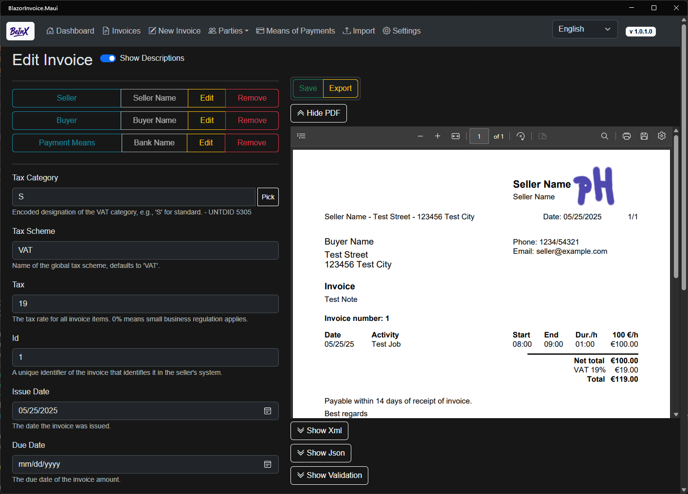

# BeInX
**Blazor eInvoice XRechnung App**

BeInX is a lightweight, open-source application designed to create, manage, and export simplified e-invoices for freelancers in compliance with the XRechnung and ZUGFeRD standards. It runs locally and completely offline as Progressive Web App (PWA).

## BeInX on GitHub Pages (Installable PWA)

BeInX is available as a fully **functional Progressive Web App (PWA)** hosted on GitHub Pages:

👉 [https://ipax77.github.io/BeInX/](https://ipax77.github.io/BeInX/)

BeInX can be used directly in your browser or installed as a PWA on Windows, macOS, Linux, Android, or iOS.
After the initial load, the app continues to work offline, with all data stored locally in the browser's IndexedDB.

## Supported Languages
* English
* German
* Spanish
* French

## Limitations
* Only **one VAT category** per invoice
* Only **credit transfer** is supported as a payment method
* PDF generation optimized for **time-based services**
* Imported invoices are treated the same as newly created invoices.

## ⚠️ Important Legal Disclaimer

This application, "Blazor eInvoice XRechung App," is provided as open-source code for informational and demonstration purposes only.

**By using this software, you agree to the terms outlined in our [DISCLAIMER.md](./DISCLAIMER.md) and [LICENSE](./LICENSE) files.**

**We accept no liability for financial losses or compliance issues related to the use of invoices generated by this application.**

# Contributing

We welcome contributions! If you're interested in helping improve BeInX, please read the [contributing guidelines](./CONTRIBUTING.md) before getting started.

# Privacy Policy
BeInX does not collect or transmit any personal data. See our full [privacy policy](./PRIVACY_POLICY.md) for more information.

# Change Log

v0.5.3

>- Update ZUGFeRD-csharp v18.0.0-beta2
>- Using basic ZUGFeRD-csharp format (ZUGFeRDVersion.Version23, Profile.Basic, ZUGFeRDFormats.CII)

v0.5.2

>- Improved mobile responsiveness.
>- Refined collapsed navigation menu behavior.

v0.5.1

>- Add Sample Invoice

v0.5.0

>- Rewrite as Progressive Web App using local IndexedDb

